<div align="center">

# Olist Agentic Data Platform

**Conversational BI cho Olist Brazilian E-Commerce — Multi-Agent LLM · Hybrid RAG · Tier-Based Access Control**

_Per-tool SSE timeline · Tavily Web Search có Domain Filter + Cache · Chat History Persistence · Admin Panel_

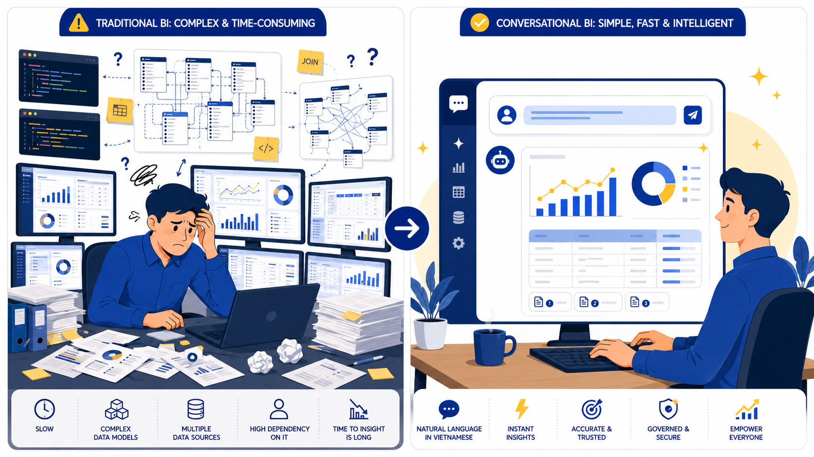

</div>

---

## Mục lục

- [Giới thiệu](#giới-thiệu)
- [Thành viên nhóm](#thành-viên-nhóm)
- [Tính năng chính](#tính-năng-chính)
- [Kiến trúc hệ thống](#kiến-trúc-hệ-thống)
- [Demo giao diện](#demo-giao-diện)
- [Cài đặt nhanh](#cài-đặt-nhanh)
- [Cấu hình môi trường](#cấu-hình-môi-trường)
- [Cấu trúc thư mục](#cấu-trúc-thư-mục)
- [Phân quyền (Tier-Based RBAC)](#phân-quyền-tier-based-rbac)
- [Web Search có Domain Filter](#web-search-có-domain-filter)
- [Kiểm thử](#kiểm-thử)
- [Hiệu năng](#hiệu-năng)
- [Triển khai production](#triển-khai-production)
- [Bảo mật](#bảo-mật)
- [Tài liệu báo cáo](#tài-liệu-báo-cáo)
- [Lời cảm ơn](#lời-cảm-ơn)

---

## Giới thiệu

**Olist Agentic Data Platform** là nền tảng Conversational BI cho phép đặt câu hỏi tự nhiên bằng **tiếng Việt** trên bộ dữ liệu thương mại điện tử công khai [Olist Brazilian E-Commerce](https://www.kaggle.com/datasets/olistbr/brazilian-ecommerce) (99.441 đơn hàng, 32.951 khách hàng, 3.095 người bán, 71 danh mục).

Hệ thống được tổ chức theo kiến trúc **3 tầng**:

| Tầng | Thành phần | Vai trò |
| --- | --- | --- |
| **Presentation** | React 18 + Vite + Tailwind | SPA neomorphic, SSE streaming, Sidebar hội thoại, AdminPanel |
| **Agent** | LangGraph 0.2 + FastAPI | Multi-agent workflow + per-tool SSE timeline + tier-gated features |
| **Data** | Postgres 16 + Qdrant 1.12 + SQLite | dbt transform, vector RAG, auth/chat/cache stores |

---

## Thành viên nhóm

**Giảng viên hướng dẫn:** TS. Nguyễn Hữu Vũ

| # | Họ tên | Vai trò |
| :-: | --- | --- |
| 1 | **Võ Trọng Nhơn** | Nhóm trưởng · Agent core (LangGraph workflow, SSE per-tool timeline, domain filter, sub-graph self-correction) |
| 2 | **Trần Xuân Diện** | Backend infrastructure · Auth (PBKDF2 + HMAC-SHA256), Tier-Based RBAC, slowapi rate limiting, FastAPI deps |
| 3 | **Đỗ Tấn Đạt** | Frontend · React SPA (Landing, Login, Sidebar, Composer, ChatMessage, ToolTimeline, WebSearchResults, AdminPanel) |
| 4 | **Nguyễn Đăng Tuấn Huy** | Data pipeline · dbt models (raw → staging → marts → serving, 40 tests), Qdrant RAG indexer, business glossary embedding |
| 5 | **Trần Phú Thọ** | Testing + DevOps · 85 pytest unit tests, Docker Compose, Cloudflare Tunnel, host-network override cho LXC Proxmox |

---

## Tính năng chính

-  **LangGraph multi-agent workflow** — manager-loop điều phối 7 sub-agent: `sql_agent` · `viz_agent` · `analytic_agent` · `time_series_agent` · `retrieval_agent` · `insight_agent` · `web_search_agent` · `chat_agent`
-  **NL2SQL** trên 4 bảng serving (`kpi_overview`, `kpi_monthly_sales`, `fct_sales_by_category`, `delivery_performance_monthly`) với **self-correction tối đa 3 vòng**
-  **Auto visualization** — Viz sub-agent tự sinh Plotly spec (bar / line) với fix-bug 2 vòng
-  **Hybrid RAG** — Qdrant lưu embedding cho 92 cột schema + 4 thuật ngữ business glossary (bge-m3 1024-dim hoặc Gemini gemini-embedding-001)
-  **Tavily Web Search** có **Domain Filter** (LLM judge + keyword fallback) + cache SQLite TTL 24h, có nút "Vẫn tra cứu Internet" override
-  **Per-tool SSE streaming** — frontend nhìn thấy từng tool đang chạy theo thời gian thực (start → done → error) qua `ContextVar` emitter, không block event loop
-  **Tier-Based RBAC** ba bậc `basic / approved / admin` + AdminPanel inline để duyệt user
-  **Chat history persistence** — SQLite chat.db, atomic INSERT … SELECT MAX(seq_no)+1 với retry, IDOR-safe, payload cap 100 KB, search title+content, export JSON
-  **Stateless auth** — HMAC-SHA256 session token 24h TTL, mật khẩu PBKDF2-SHA256 200k vòng (OWASP 2023)
-  **Rate limiting** — slowapi: login 10/min, register 5/min, chat 60/min
-  **85 unit tests** xanh trong ~14 giây
-  **One-command deployment** — `docker compose up -d`, public qua Cloudflare Tunnel

---

## Kiến trúc hệ thống

### Sơ đồ tổng quát ba tầng

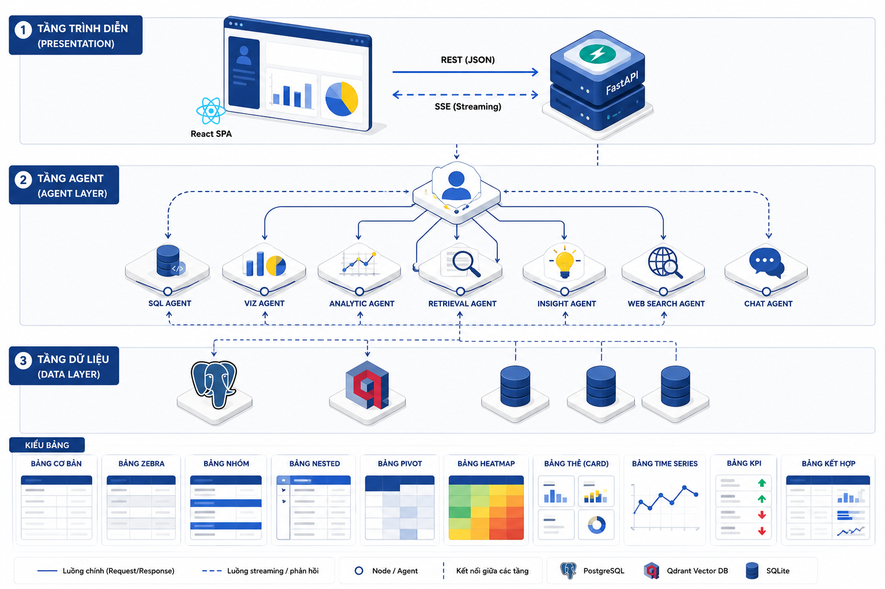

### LangGraph state machine

Workflow chính: `START → classify_intent → manager_loop → {sub-agents} → synthesize → END`. Manager-loop pop từng phần tử trong `pending_agents` cho đến khi rỗng hoặc iteration > 6.

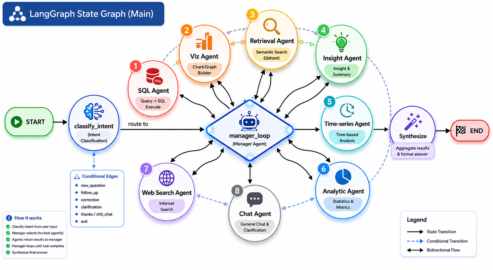

### Sub-graph SQL agent với self-correction (3 vòng)

`table_selection` (Qdrant top-6 bảng) → `query_generation` (LLM + schema context) → `query_execution` (AST guardrail chỉ-đọc) → **decision** → `bug_fixing` → loop về `query_generation`.

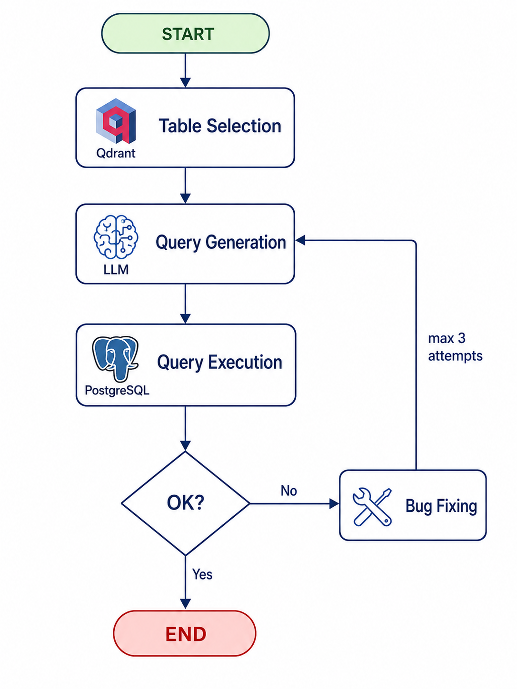

### Sub-graph Viz agent với self-correction (2 vòng)

`viz_code_gen` (sinh spec JSON `{chart_type, value_column, label_column}`) → `viz_code_exec` (validate cột tồn tại, chart_type ∈ {bar, line}) → **decision** → `viz_fixbug` → loop.

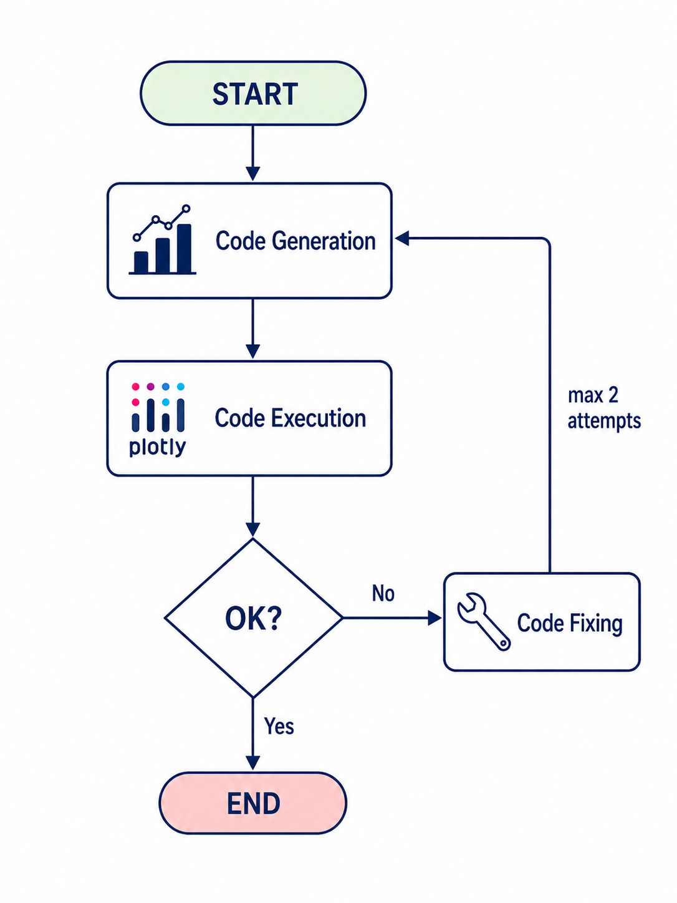

### Tavily Web Search + Domain Filter

Pipeline: `toggle check` → `domain classifier` (LLM YES/NO + keyword fallback) → `cache lookup` (24h TTL) → `Tavily API` → kết quả. Có nhánh **bypass** `force_web_search` khi user click "Vẫn tra cứu Internet".


### Tier-Based RBAC

Mô hình ba bậc bao trùm: `admin` ⊇ `approved` ⊇ `basic`. Admin click một nút để promote, backend tự đồng bộ tier ↔ is_admin.

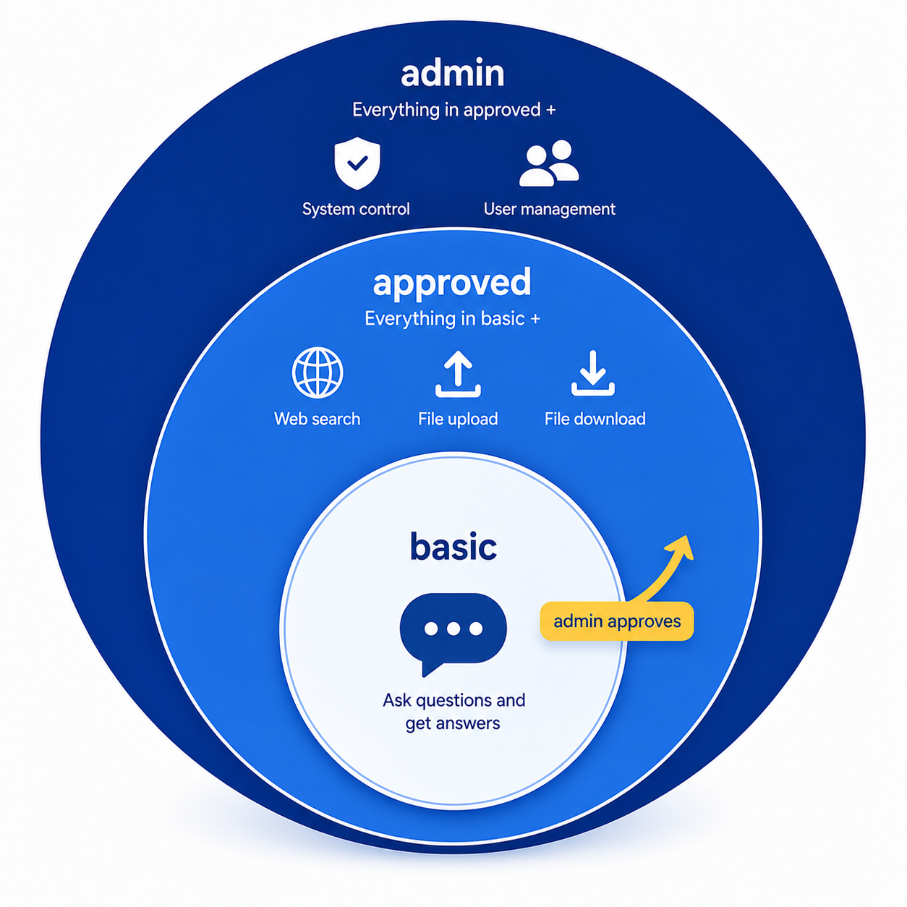

---

## Demo giao diện

### Landing page

Trang chủ neomorphic / brutalist với CTA đăng nhập + giới thiệu pipeline.

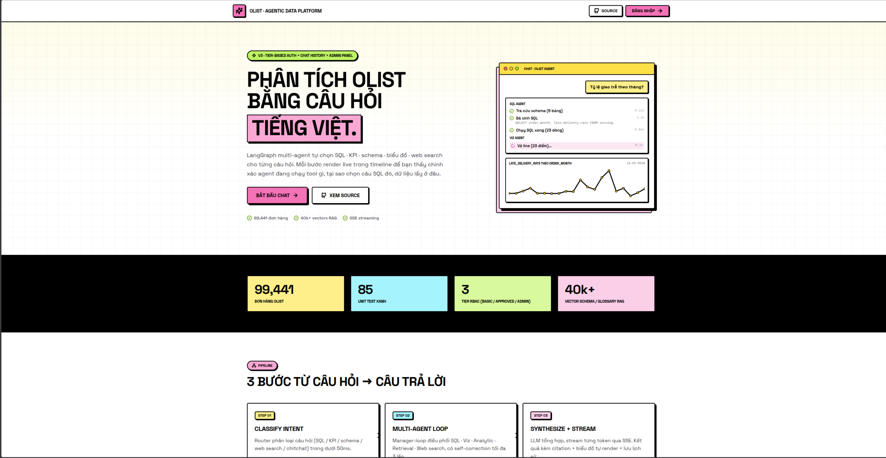

### Luồng chat end-to-end

User gõ câu hỏi tiếng Việt → ToolTimeline live → bảng dữ liệu + biểu đồ Plotly + câu trả lời tóm tắt.

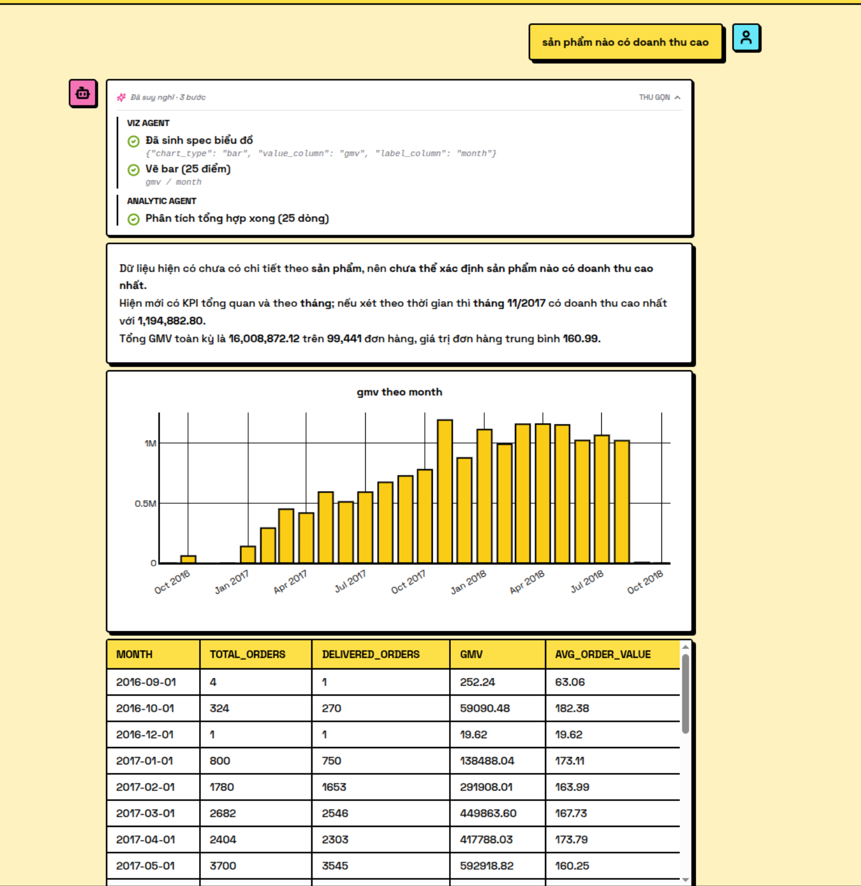

### Sidebar hội thoại

Search + rename + delete + export JSON. Auto-collapse khi màn hình hẹp.

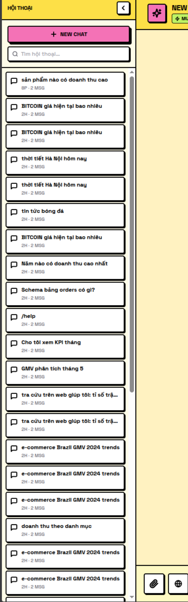

### AdminPanel quản lý user

Bảng user với 3 nút tier (basic / approved / admin) + toggle is_admin bit. Đồng bộ hai chiều ở backend.

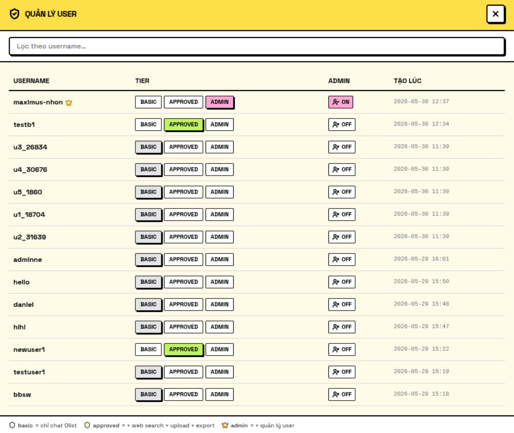

---

## Cài đặt nhanh

### Yêu cầu

- Docker 24+ và Docker Compose v2
- 6 GB RAM trống, 5 GB ổ đĩa
- (Tuỳ chọn) tài khoản [Tavily](https://tavily.com/) free 1.000 call/tháng cho web search

### Khởi động stack đầy đủ

```bash
git clone https://github.com/nhonhoccode/agentic-data-platform.git
cd agentic-data-platform

cp .env.example .env
# Chỉnh các biến nhạy cảm trong .env trước khi chạy prod:
#   APP_API_KEY, APP_ADMIN_PASSWORD, APP_SESSION_SECRET, POSTGRES_PASSWORD
#   TAVILY_API_KEY (nếu dùng web search)
#   LLM_PROVIDER + key tương ứng

docker compose up -d --build

# Đợi bootstrap chạy xong (~30s — load CSV + dbt run + 40 tests PASS):
docker compose logs -f bootstrap

# Index Qdrant một lần (~10s):
docker exec olist-api python -m app.rag.indexer
```

### Truy cập các dịch vụ

| Service | URL | Ghi chú |
| --- | --- | --- |
| Web UI | http://localhost:8000/ui | SPA chính |
| API docs | http://localhost:8000/docs | Swagger OpenAPI |
| Liveness | http://localhost:8000/health/liveness | Public |
| Readiness | http://localhost:8000/health/readiness | Public |
| Health (full) | http://localhost:8000/health | Yêu cầu `X-API-Key` |
| Airflow | http://localhost:8080 | `AIRFLOW_ADMIN_USERNAME` / `_PASSWORD` từ `.env` |
| Qdrant dashboard | http://localhost:6333/dashboard | Api-key từ `.env` |
| Public tunnel | `https://<random>.trycloudflare.com/ui` | `docker compose logs cloudflared` |

### Frontend dev (hot reload)

```bash
cd frontend
npm install
npm run dev    # http://localhost:5173 (proxy API → :8000)
npm run build  # build vào ../app/ui/static/dist/
```

### Dừng / dọn dẹp

```bash
docker compose down            # giữ volume
docker compose down -v         # xoá luôn volume Postgres + Qdrant
```

---

## Cấu hình môi trường

### LLM Provider (chọn 1)

```env
# 1) Deterministic local-first (không cần API key)
LLM_PROVIDER=none

# 2) Gemini
LLM_PROVIDER=gemini
GEMINI_API_KEY=your_gemini_key
MODEL_API_BASE=gemini-2.0-flash
TEMPERATURE=0

# 3) DeepSeek
LLM_PROVIDER=deepseek
DEEPSEEK_API_KEY=your_deepseek_key
MODEL_API_BASE=deepseek-chat
TEMPERATURE=0

# 4) Self-host OpenAI-compatible (Qwen / 9router / vLLM)
LLM_PROVIDER=self_host
MODEL_API_BASE=Qwen/Qwen3.5-27B
OPENAI_API_KEY=your_gateway_key
BASE_URL=https://apimodel.berp.vn/v1
TEMPERATURE=0
LLM_ENABLE_THINKING=false
```

### Web Search (Tavily)

```env
TAVILY_API_KEY=tvly-...
WEB_SEARCH_ENABLED=true
WEB_SEARCH_MAX_RESULTS=5
```

### Embedding Provider

```env
EMBEDDING_PROVIDER=gemini        # hoặc "bge-m3"
GEMINI_EMBEDDING_MODEL=gemini-embedding-001
```

### Bảo mật (bắt buộc đổi trên prod)

```env
APP_API_KEY=<random-32-bytes>
APP_ADMIN_USERNAME=admin
APP_ADMIN_PASSWORD=<strong-password>
APP_SESSION_SECRET=<random-32-bytes>
POSTGRES_PASSWORD=<strong-password>
POSTGRES_READONLY_PASSWORD=<strong-password>
APP_ENV=prod                     # bật check secret default
```

---

## Cấu trúc thư mục

```
agentic-data-platform/
├── app/
│   ├── agent/
│   │   ├── core.py              ─ stream_workflow + emit_tool + BlockReason
│   │   ├── domain_filter.py     ─ classify_in_domain (LLM + keyword + cache)
│   │   ├── domain_keywords.py   ─ POSITIVE / NEGATIVE sets
│   │   ├── cache.py             ─ SQLite TTL cache (domain, tavily)
│   │   ├── models.py            ─ AgentState TypedDict
│   │   ├── router.py            ─ intent classifier
│   │   ├── tools.py             ─ web_search_tool (Tavily), schema_search
│   │   ├── sql/graph.py         ─ SQL sub-graph + self-correction (3 vòng)
│   │   ├── viz_graph.py         ─ Viz sub-graph + fixbug (2 vòng)
│   │   └── analytic_graph.py
│   ├── api/v2/
│   │   ├── schemas.py           ─ ChatRequest / ChatResponse / Block
│   │   └── service.py           ─ run_chat
│   ├── ui/
│   │   ├── auth.py              ─ HMAC token issue/verify
│   │   ├── userstore.py         ─ User CRUD + tier helpers (sync)
│   │   ├── chatstore.py         ─ Conversation CRUD + search + export
│   │   ├── capabilities.py      ─ quick_commands + features matrix
│   │   └── routes.py            ─ /ui/proxy/{auth,admin,conversations,chat}
│   ├── ingestion/loader.py
│   ├── rag/indexer.py
│   ├── transform/serving.py
│   ├── config.py
│   └── main.py                  ─ FastAPI app + slowapi + prod secret check
├── frontend/
│   ├── src/
│   │   ├── App.tsx
│   │   ├── components/          ─ Landing, Login, AdminPanel, Sidebar,
│   │   │                           Composer, ChatMessage, ToolTimeline,
│   │   │                           WebSearchResults, DataTable, Plot
│   │   ├── hooks/               ─ useChat, useConversations, useSidebarCollapsed
│   │   └── lib/                 ─ api.ts, session.ts, utils.ts
│   ├── vite.config.ts
│   └── tailwind.config.js
├── tests/unit/                  ─ 85 pytest tests
├── dbt/                         ─ raw → staging → marts → serving + 40 tests
├── data/                        ─ Olist CSVs + auth.db + chat.db (gitignored)
├── images/                      ─ Ảnh dùng trong báo cáo + README
├── scripts/
│   ├── gen_report_v2.py         ─ Sinh báo cáo .docx tự động
│   └── bootstrap_data.sh
├── docs/
│   └── cloudflare_access.md
├── docker-compose.yml
├── docker-compose.override.yml  ─ LXC host-network (gitignored mẫu)
└── pyproject.toml
```

---

## Phân quyền (Tier-Based RBAC)

| Tier | Tính năng |
| --- | --- |
| `basic` | chat (chỉ trên Olist Postgres + glossary) |
| `approved` | basic + `web_search` + `upload` + `export` |
| `admin` | approved + `/admin/users` (quản lý tier + is_admin bit) |

Trong DB `auth.db`, bảng `users` có hai cột liên quan: `tier` (basic/approved/admin) và `is_admin` (0/1). Hai cột được **đồng bộ tự động** ở [app/ui/userstore.py](app/ui/userstore.py):

- `set_tier('admin')` → tự bật `is_admin=1`
- `set_tier('basic'|'approved')` → tự tắt `is_admin=0`
- `set_is_admin(true)` → tự bump `tier='admin'`
- `set_is_admin(false)` → demote `tier` admin → approved

Frontend gate ở [App.tsx](frontend/src/App.tsx) dùng `is_admin || tier === "admin"` làm defense-in-depth.

---

## Web Search có Domain Filter

Để tránh user lạm dụng Tavily cho câu hỏi ngoài phạm vi (thời tiết, ca sĩ, bóng đá), `web_search_agent` có **5 bước gate**:

1. Bypass nếu `blocked_answer` đã set từ trước (`TOGGLE_OFF_USER` / `TOGGLE_OFF_ADMIN`)
2. Câu hỏi rỗng → block `BLANK_QUERY`
3. `classify_in_domain(question)` — LLM judge với prompt few-shot, có **keyword fallback** khi LLM offline; cache SQLite TTL 24h
4. `_rewrite_search_query` — rewrite câu hỏi dựa trên conversation history
5. Gọi `web_search_tool` → Tavily

User có thể **override** bằng nút "Vẫn tra cứu Internet" → request gửi `force_web_search=true` → skip bước 3.

**Domain ratio**: tester 70 câu (35 in-domain + 35 out-of-domain) → classifier đúng 66/70 (**94,3%**).

---

## Kiểm thử

### Chạy unit test

```bash
docker exec olist-api pip install pytest pytest-sugar -q
docker exec -it olist-api bash -c "cd /opt/project && pytest tests/unit/ --color=yes"
```

Kết quả: **85 / 85 PASS** trong ~14 giây.

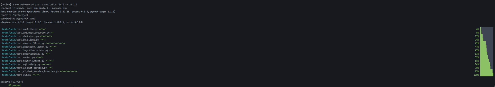

Phân bố:

| Module | Số test | Mô tả |
| --- | :-: | --- |
| `test_chatstore` | 9 | CRUD, IDOR rejection, ordering, cascade delete, payload cap, search, export |
| `test_domain_filter` | 12 | Parse VERDICT (bold/JSON/fenced/quoted/lowercase) + keyword logic |
| `test_v2_chat_service_branches` | 13 | Help, /sql, /schema, /definition, /kpi, agent success, history threading |
| `test_router` | 5 | Intent keyword detection |
| `test_router_intent` | 6 | Web search trigger keywords |
| `test_sql_safety` | 7 | AST guardrail block INSERT/UPDATE/DELETE/DDL |
| `test_v2_chat_service` | 3 | ChatRequest / ChatResponse schema |
| `test_viz` | 6 | Heuristic chart spec + fallback |
| Khác | 24 | analytic, api deps, db client, ingestion, observability |
| **TỔNG** | **85** | **100% PASS** |

### Logs SSE stream từ container

```bash
docker compose logs -f api
# Trong tab khác, trigger chat stream:
curl -N -X POST http://localhost:8000/api/v2/chat/stream \
  -H "X-API-Key: $APP_API_KEY" -H "Content-Type: application/json" \
  -d '{"message":"doanh thu theo danh mục"}'
```

Log sẽ hiện xen kẽ `INFO POST /chat/stream 200 OK` với `emit_tool(sql_agent, table_selection, start/done)` theo thời gian thực:

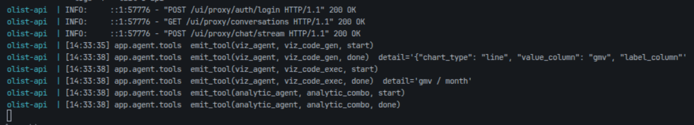

---

## Hiệu năng

Đo trên LXC Proxmox · Intel Xeon 6 vCore · 16 GB RAM · Gemini 2.5 Flash · n=30 query/intent.

| Intent | p50 | p95 | p99 |
| --- | :-: | :-: | :-: |
| `sql_query` (1 dòng) | 1,2 s | 1,9 s | 2,4 s |
| `sql_query` (~25 dòng + chart) | 1,8 s | 2,7 s | 3,5 s |
| `kpi_summary` | 1,1 s | 1,6 s | 2,1 s |
| `web_search` (cache miss) | 4,2 s | 5,8 s | 7,1 s |
| `web_search` (cache hit) | 0,9 s | 1,3 s | 1,7 s |
| `chitchat` | 0,6 s | 1,0 s | 1,3 s |


**Cache hit rate**: `domain` 34,3% (TTL 24h) · `tavily` 44,4% (TTL 1h).

---

## Triển khai production

### Cloudflare Tunnel (public demo)

```env
# .env
CLOUDFLARED_COMMAND=tunnel --no-autoupdate run --token <tunnel_token>
```

Route trong Cloudflare Tunnel UI → "Published application routes":

| Hostname | Service |
| --- | --- |
| `api.votrongnhon.cloud` | `http://api:8000` |
| `ui.votrongnhon.cloud` | `http://api:8000` |

Khuyến nghị bật **Cloudflare Access Policy** cho mọi route public.

### LXC Proxmox host-network override

Trên Proxmox LXC container, IPv6 dual-stack đôi khi không bind được. Dùng [docker-compose.override.yml](docker-compose.override.yml):

```yaml
services:
  api:
    network_mode: host
    environment:
      UVICORN_HOST: "::"
      UVICORN_PORT: "8000"
```

### Manual rebuild data pipeline

```bash
dp-ingest                                       # CSV → Postgres raw
cd dbt && dbt deps && dbt run && dbt test       # 40/40 PASS
python -m app.transform.serving                 # serving validation
python -m app.rag.indexer                       # Qdrant schema + glossary
```

### Makefile shortcuts

```bash
make lint                # ruff + tsc
make test                # pytest tests/unit/
make ingest              # dp-ingest
make serve               # uvicorn local
make e2e                 # full smoke test
make up / down           # docker compose
make logs-bootstrap
make precommit-install
make precommit-run
```

---

## Bảo mật

- **Không commit** API key thật vào `.env` — chỉ commit `.env.example` với placeholder
- Khi `APP_ENV=prod`, bootstrap kiểm tra các biến `APP_API_KEY`, `APP_ADMIN_PASSWORD`, `APP_SESSION_SECRET`, `POSTGRES_PASSWORD` — raise lỗi nếu vẫn là default yếu (`change-me`, `admin@123`, rỗng)
- Mật khẩu băm **PBKDF2-HMAC-SHA256** với salt 16 byte ngẫu nhiên + 200.000 vòng iterate (OWASP 2023)
- Session token **stateless HMAC-SHA256** — secret là `APP_SESSION_SECRET` (fallback `APP_API_KEY`), TTL 24h
- API đọc dữ liệu qua role read-only riêng `POSTGRES_READONLY_USER` — đề phòng SQL injection từ `query_generation`
- Mọi truy vấn từ agent đi qua **AST guardrail** chỉ chấp nhận `SELECT`/`WITH`, block `INSERT`/`UPDATE`/`DELETE`/`DDL`
- Chat persistence **IDOR-safe**: mọi `append_message` JOIN ownership check (`WHERE username=?`) → raise `PermissionError` nếu user không sở hữu conversation
- **Rate limit** slowapi: `/login` 10/min, `/register` 5/min, `/chat/stream` 60/min
- Files nhạy cảm gitignore: `data/*.db*`, `docker-compose.override.yml`, `*.env` (trừ `.env.example`)
- Nếu lỡ commit key, **rotate ngay** và rewrite history bằng `git filter-branch` hoặc `git-filter-repo`

---

## Tài liệu báo cáo

- Báo cáo cuối kỳ (.docx): [BaoCao_OlistAgenticDataPlatform.docx](BaoCao_OlistAgenticDataPlatform.docx) — 5 chương · 19 bảng · 16 H1 · 42 H2
- Script sinh báo cáo tự động: [scripts/gen_report_v2.py](scripts/gen_report_v2.py)
- Sửa nội dung báo cáo:

```bash
# Edit gen_report_v2.py rồi:
docker exec olist-api pip install python-docx -q
docker exec olist-api python3 /opt/project/scripts/gen_report_v2.py
# → data/BaoCao_OlistAgenticDataPlatform.docx được ghi đè
```

---

## Lời cảm ơn

Nhóm xin chân thành cảm ơn **TS. Nguyễn Hữu Vũ** đã trực tiếp hướng dẫn, định hướng đề tài và góp ý kỹ thuật xuyên suốt quá trình triển khai. Cảm ơn quý thầy cô Khoa Công nghệ Thông tin — Trường Đại học Công nghiệp TP. Hồ Chí Minh đã truyền đạt kiến thức nền tảng về Cơ sở dữ liệu, Học máy, Xử lý ngôn ngữ tự nhiên và Kỹ thuật phần mềm.

Dự án sử dụng các công cụ và bộ dữ liệu mã nguồn mở: [LangGraph](https://github.com/langchain-ai/langgraph), [FastAPI](https://fastapi.tiangolo.com/), [Qdrant](https://qdrant.tech/), [dbt](https://www.getdbt.com/), [Tavily](https://tavily.com/), [Plotly](https://plotly.com/javascript/react/), [Olist Brazilian E-Commerce Public Dataset](https://www.kaggle.com/datasets/olistbr/brazilian-ecommerce).

---

<div align="center">

**© 2026 — Olist Agentic Data Platform**
Nhóm 5 sinh viên DHKHDL18A · Khoa CNTT · ĐH Công nghiệp TP. HCM

</div>
